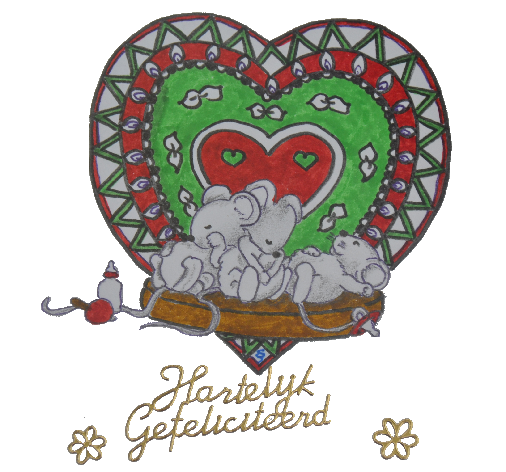

+++
+++

Het koppie van zo’n kleintje is iets wat nooit verveelt \
zijn pappa is zijn held en grote voorbeeld \
Alles wat pappa doet houdt hij in de gaten \
na verloop van tijd begint hij korte zinnetjes te praten

Het leven met een kleintje zet je wereld op z'n kop \
alles draait nu om dat knaapje \
eten, spelen, huilen en met regelmaat een slaapje \
zijn ouders onderdrukken hier en daar een gaap(je) \
want die kleine nachtbraker maakt je soms doodop

Het kereltje zal je nooit gaan vervelen \
en weet met zijn lachje alle harten te stelen \
Eerst alleen, dan met z’n twee, nu met drie \
en tussen hen in een bijzondere chemie

