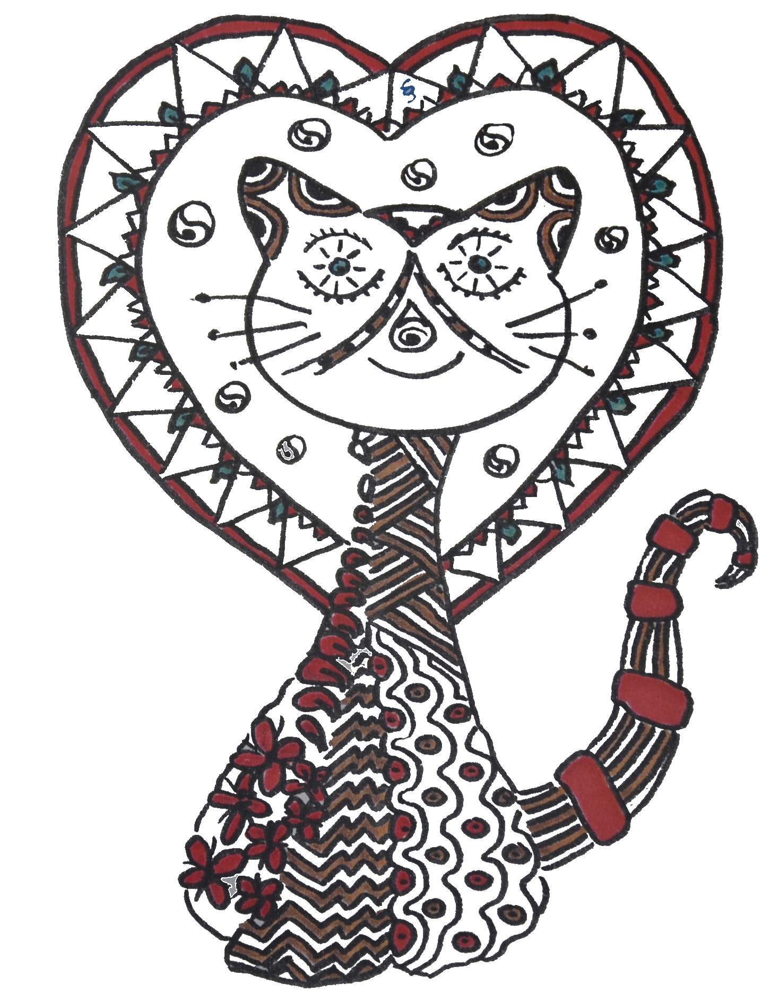

+++
+++

Als de kat van huis is \
gaat hij op ontdekkingstocht \
eet onderweg muis of vis \
die hij tijdens zijn jacht bevocht

Het zwerven zit in zijn bloed \
lekker vrij zijn tussen al het groen \
ach, dat doet 'm toch zo goed \
struinen over het plantsoen

Wind en regen is niet zo fijn \
nattigheid en koude houdt hij niet van \
dan is het goed om weer thuis te zijn \
spinnen bij baasje en kachel als het even kan

Of hij nu naar Oost gaat of naar West \
t' is toch net als bij de mens \
de kat is thuis op z'n allerbest  \
maar verkent buiten steeds zijn grens

