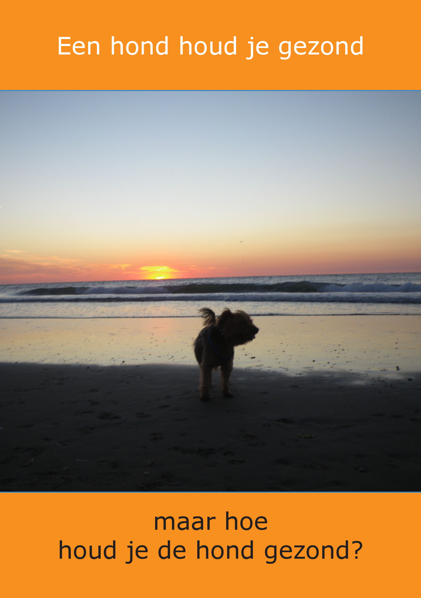
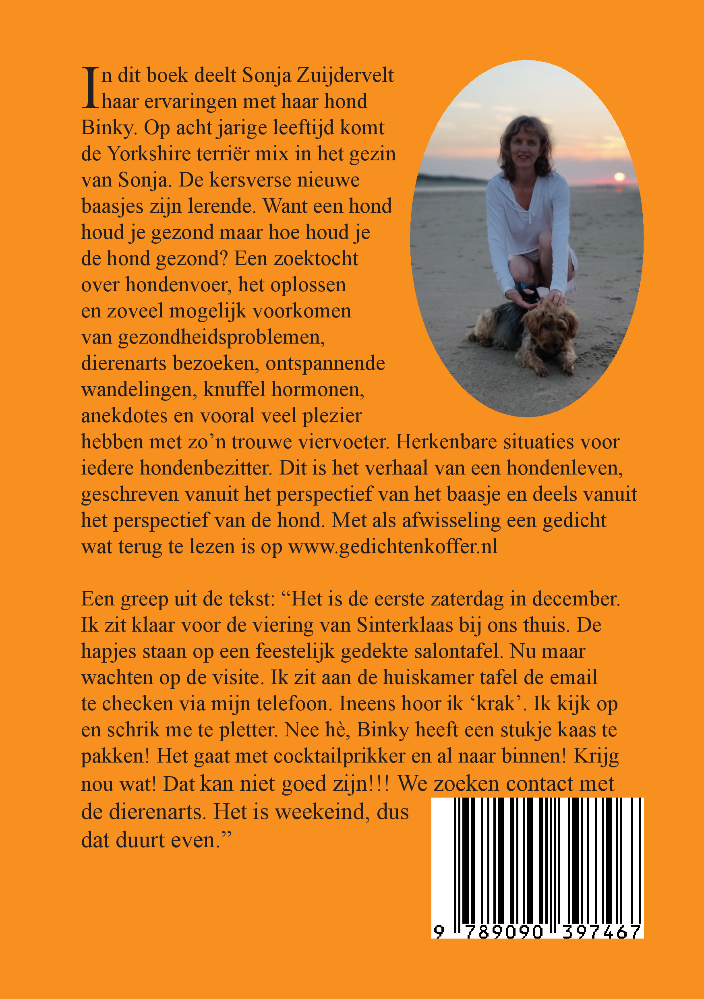

+++
+++

Enthousiast rent ze over het strand\
volgt de golven heen en weer\
graaft kuiltjes in het natte zand\
neemt een sprint op en neer

Wat een energie, ze is al elf\
maar gedraagt zich als een jonge hond \
op het strand gaat dat vanzelf \
de zee, de zilte lucht maakt haar gezond

Ze ruikt en volgt een spoor\
dan weer hier, dan weer daar\
"Pas op, niet happen hoor!\
Dan word je 'zeeziek', dat is naar!"

En na zo'n heerlijk uitje strand\
valt ze thuis al snel in dromenland

Uit: Een hond houd je gezond maar hoe houd je de hond gezond?\
Te bestellen via [info@gedichtenkoffer.nl](mailto:info@gedichtenkoffer.nl) ISBN 9789090397467

TRRING TRRING gaat de deurbel\
WOEF WOEF WOEF WOEF klinkt het weer\
Ach, onze levende deurbel\
gaat vol energie te keer

Ik schrik me de tering\
mijn hart schiet in mijn keel\
ze doet niet aan dosering\
little to much, te veel

Ze is een schat, echt waar\
bijzonder waaks, dat wel\
maar ik denk: "Bedaar!
en liefst een beetje snel!"

Even checken wie daar is\
kwispelend, snuffelend, enthousiast\
bekende geur, zoet, zout of fris\
ontdekt ze een likje verrast

Haar energiepiek duurt maar kort\
het is even een stressmoment\
is het te trainen zodat het beter wordt?\
of raken we er wel aan gewend?