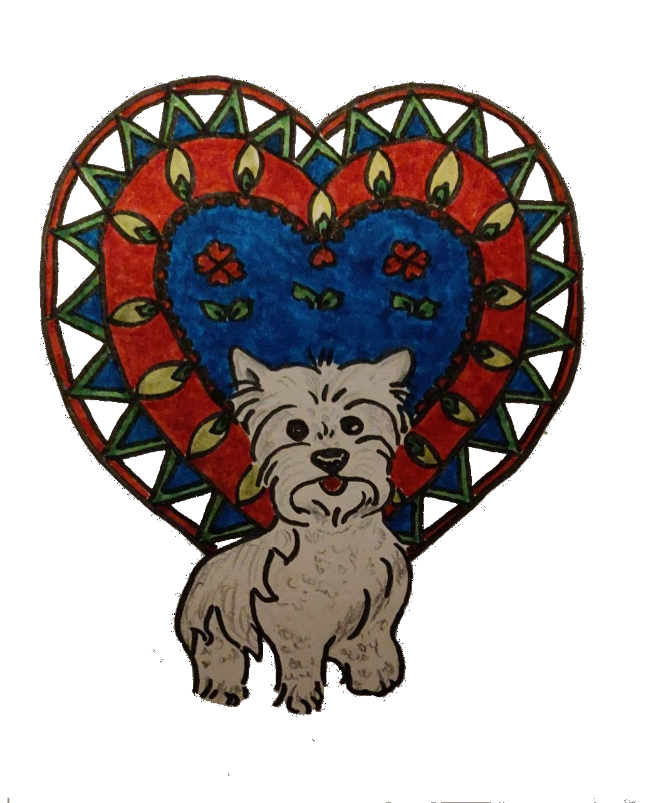

+++
+++

Hondje met bal in zijn mond \
rent vrolijk in het rond \
en legt de bal terstond \
voor de voeten van zijn baasje neer \
die gooit de bal nog een keer \
zo ver weg als hij maar kan \
zijn hondje snelt er achter an

Het is bewegingstherapie \
voor mens en dier en zie \
beiden hebben het al aardig onder de knie \
Het ontspant lichaam en geest \
wie geniet er nu het meest? \
Ik weet het even nie

