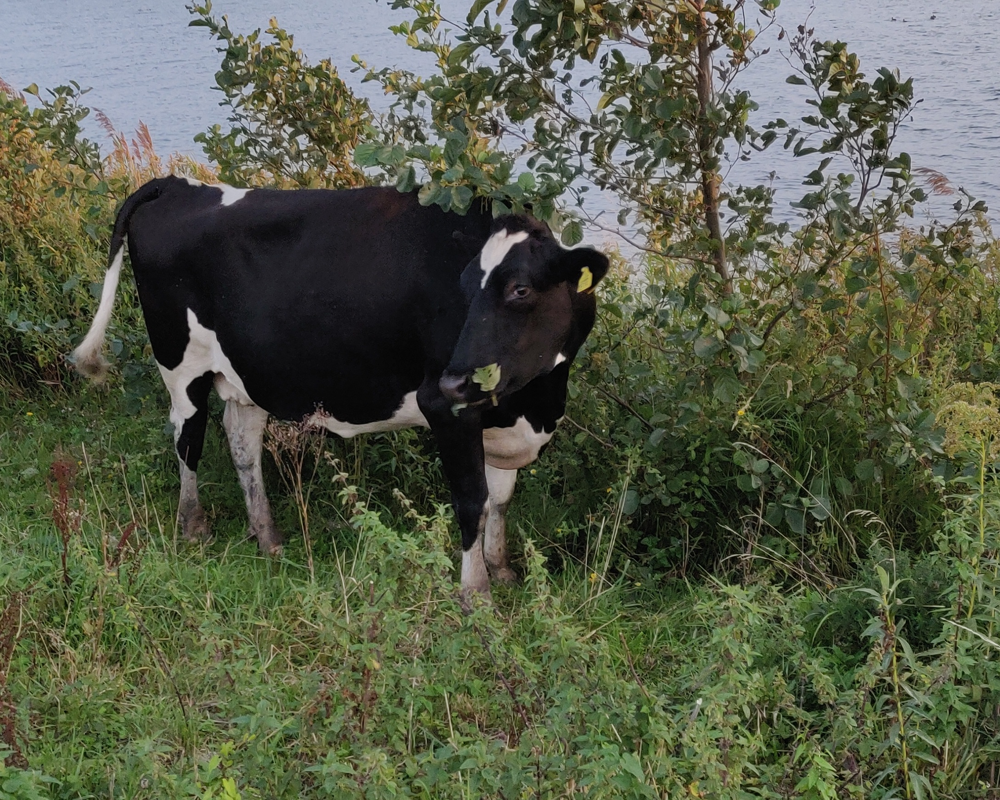

+++
+++

Ouwe koeien uit de sloot halen, \
tsjonge, wat een gedoe \
Dat geduw en getrek \
maakt de boer ontzettend moe

We praten hier niet over koetjes en kalfjes \
die zijn lekker klein van stuk \
Nee, hij moet de koe bij de horens vatten \
maar niemand vaart wel zonder geluk

