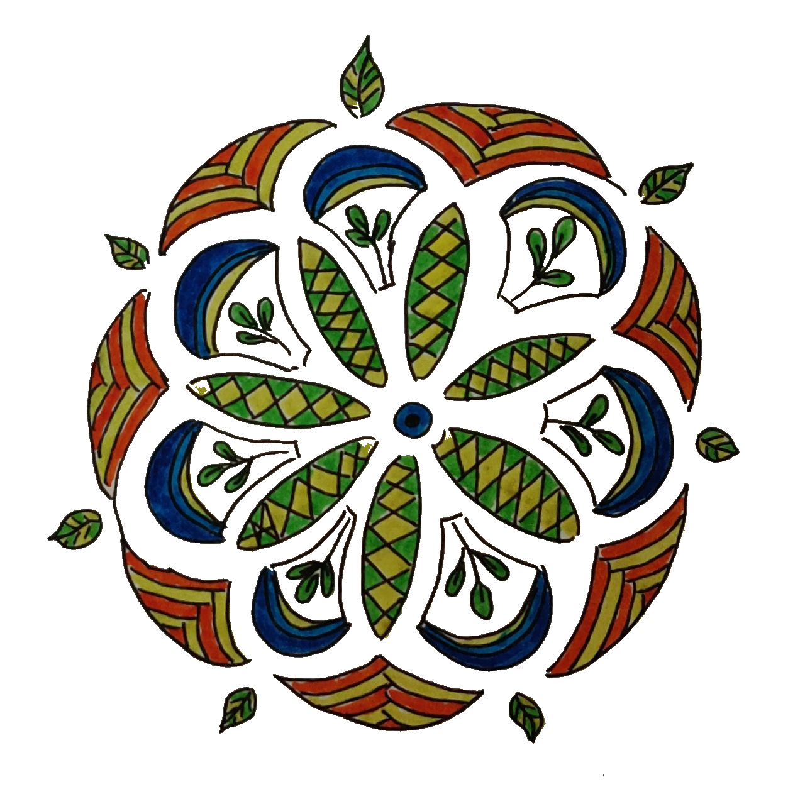

+++
+++

De grond verdwijnt onder mijn voeten vandaan \
wat is boven, wat is onder? \
Ik voel mijn lichaam onderuit gaan \
mijn evenwicht verstoord, ik kan niet zonder

Alles draait om mij \
maar dan letterlijk \
heel langzaam trekt het weer voorbij \
licht in mijn hoofd, ongemakkelijk

Dronken zonder alcohol \
mijn eigen kermisattractie \
mijn hoofd slaat op hol \
wat is dit voor actie?

Ben uit balans gebracht \
herstel kost tijd \
en een dosis mentale kracht \
ik ben de weg een beetje kwijt

C’est la vie, ben onderuit gehaald \
draai-duizelig en licht verdwaald \
sta weer op vol goede moed \
hoor mijn moeder: “Schatje, het komt goed!”

